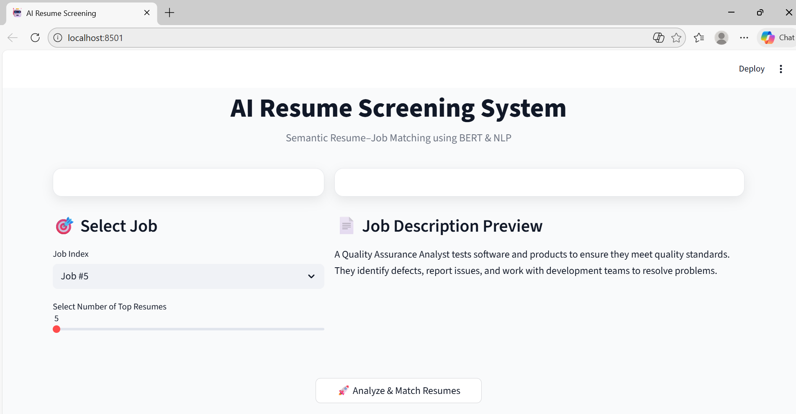
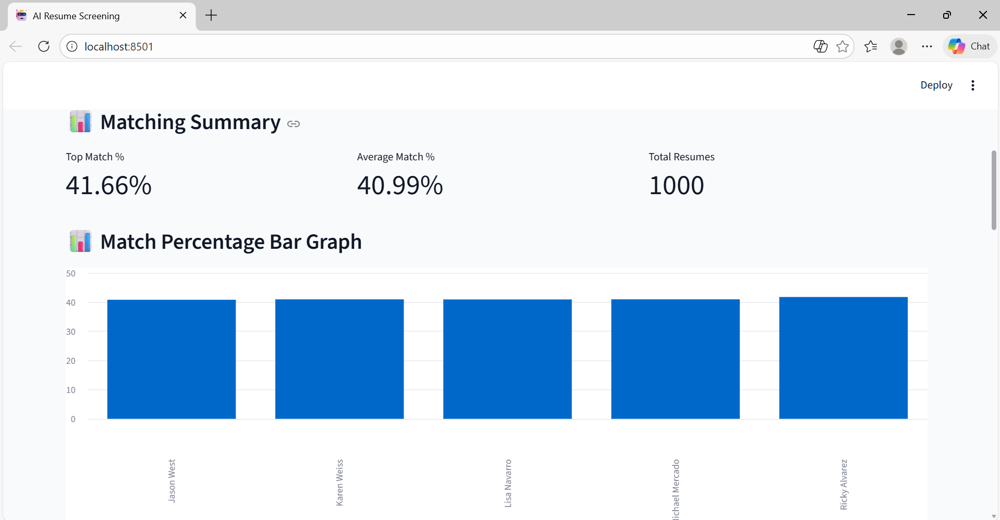

# AI-Powered Resume Screening System Using BERT

## Overview

The AI-Powered Resume Screening System is an NLP-based application that automates the process of matching resumes with job descriptions. The system leverages BERT embeddings and cosine similarity to evaluate candidate suitability and rank resumes according to their relevance to a given job role.

This project helps recruiters reduce manual screening effort and identify the most suitable candidates efficiently.

## Features

- Resume and Job Description Analysis
- BERT-Based Text Embeddings
- Resume Ranking using Cosine Similarity
- Automated Candidate Matching
- Interactive Streamlit Dashboard
- Data Visualization and Insights
- Fast and Scalable Resume Screening

## Tech Stack

### Programming Language

- Python

### Libraries & Frameworks

- Streamlit
- Pandas
- NumPy
- Scikit-Learn
- Sentence Transformers
- TensorFlow / Keras
- Altair

### NLP Techniques

- Text Cleaning
- Text Preprocessing
- BERT Embeddings
- Semantic Similarity

## Project Workflow

1. Load resume and job description datasets.
2. Clean and preprocess textual data.
3. Generate contextual embeddings using BERT.
4. Calculate cosine similarity between resumes and job descriptions.
5. Rank resumes based on similarity scores.
6. Display ranked candidates through a Streamlit dashboard.

## Project Structure

```text
Resume-Screening-Project/
│
├── app.py
├── requirements.txt
├── README.md
│
├── data/
│   ├── raw/
│   └── processed/
│
├── source/
│   ├── load_data.py
│   ├── cleaned_text.py
│   ├── prepared_text.py
│   ├── bert_embedding.py
│   ├── resume_match.py
│   └── save_results.py
│
└── outputs/
    ├── screenshots/
    └── results/
```

## Installation

### Clone Repository

```bash
git clone https://github.com/Teja2037/Resume-Screening-Project.git
cd Resume-Screening-Project
```

### Create Virtual Environment

```bash
python -m venv venv
```

Activate environment:

Windows

```bash
venv\Scripts\activate
```

Linux / Mac

```bash
source venv/bin/activate
```

### Install Dependencies

```bash
pip install -r requirements.txt
```

## Run the Application

```bash
streamlit run app.py
```

The application will open in your browser automatically.

## Dataset

The project uses:

- Resume Dataset
- Job Description Dataset

These datasets are processed and transformed into semantic embeddings using BERT for similarity matching.

## Results

The system successfully:

- Extracts and preprocesses resume content
- Generates BERT embeddings
- Calculates similarity scores
- Ranks candidates based on relevance
- Provides an interactive visualization dashboard

## Screenshots

### Application Dashboard

## Application Dashboard



## Resume Ranking Results



## Future Enhancements

- Multi-job recommendation system
- Skill extraction using Named Entity Recognition (NER)
- Resume parsing from PDF and DOCX files
- Integration with recruitment portals
- Advanced ranking using Large Language Models (LLMs)

## Author

**Varun Teja**

B.Tech Student | Aspiring Software Engineer

GitHub: https://github.com/Teja2037

## License

This project is licensed under the MIT License.
